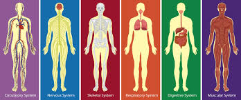

# Description   

###  **Mock Landing Page** is a Web Development Foundations project to create a Company Landing webpage using CSS Flexbox properties.

####  The thrust of the project is using flexbox to design and build the layout for a company’s homepage.
  *  I opted to create my own mock webpage for a health and conditioning company.
  *  Show some of the many CSS property design tools to layout a home page.
  *  Provide a Mission Statement, and brief information about the company.
  *  A list or set of images and titles representing the product or products of the company.
  *  A section describing some of the company’s employees or teammates.

## Table of Contents
   *  README.md
   *  index.html
   *  style.css
   *  Images 
   *  LICENSE
   *  gitignore
   *  Favicon tab image placed in root directory
   *  
      

## General Information
   *  This project uses HTML5 and CSS3, with an emphasis on flexbox’s advantages, such as easy horizontal and vertical positioning,
   *  flexible element flows as the page size changes, and great styling for repeated elements.
   *  The README.md utilized the Markdown language syntax and includes an image of the favicon.
   *  This project was completed in Visual Studio Code, and Bash Terminal.
   * [Click here to view](https://jalcoding8.github.io/Mock_Landing_/)
     
 
   

## Technologies
   *  Utilizing Markdown language for the README.md content
   *  Visual Studio Code
   *  Using git commands in bash shell (zsh) terminal and GitHub
   *  HTML5
   *  CSS3
   *  favicon tab image generator
   *  Google Fonts API
